# Mobile Flashcards Project

This is the final assessment project for Udacity's React Native course, the Mobile Flashcards study app, where the user can make decks of cards and take quizzes.

## To get started

* clone project with `https://github.com/susumoa/mobile-flashcards.git`
* install all project dependencies with `yarn install` or `npm install`
* start the development server with `yarn start` or `npm start`

## How to use

### Deck view

#### No decks

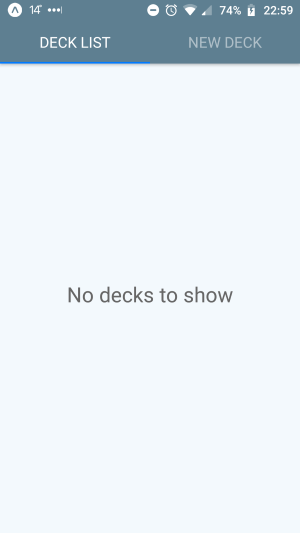

The tab bar shows the Deck list tab as selected. If no decks are submitted No decks to show appears.

#### Decks

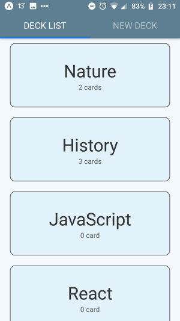

The tab bar shows the Deck list tab as selected. If the user created  decks, the decks appear in cronological order.

### New deck view

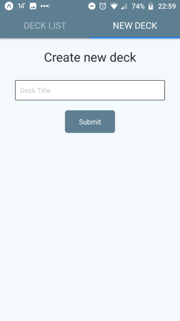

The tab bar shows the New deck tab as selected. To create a new deck, add a title to the deck and submit. If the input field is empty when the submit button is pressed, a pop up alert appears. If the title is an already existing deck title, a pop up alert appears. Correctly submitting the deck routes to the newly created deck.

### Deck view

#### No cards

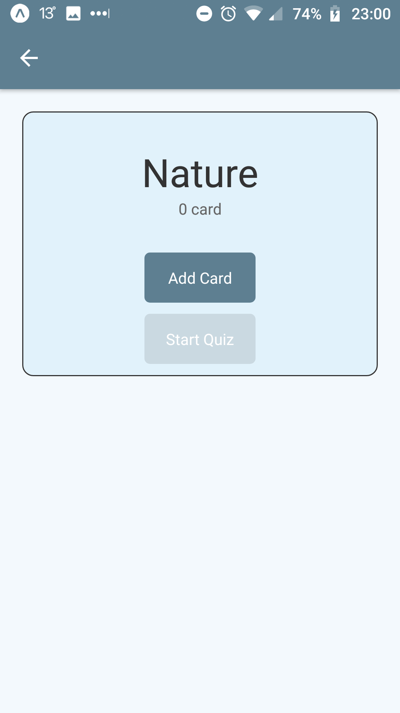

The deck's title, the number of cards in the deck, the Add card button and the Start quiz button are shown. If there are no cards in the deck, the Start quiz button is disabled.

#### Cards

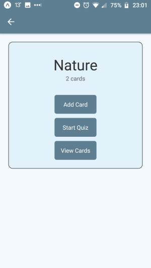

The decks title, the number of cards in the deck, the Add card button and the Start quiz button are shown. If there are cards in the deck, a third button appears, called View cards.

### New card view

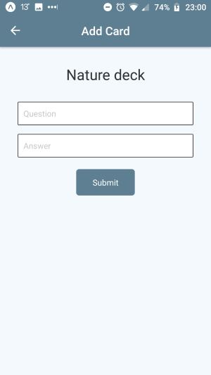

The header is Add Card. The deck's title, two input fields and a Submit button are shown. The first input field is for the question, the second is for the answer. If any of the input fields are empty upon submitting the card, a pop up alert asks for a question or an answer. Submitting the card routes back to the deck.

### Card list view

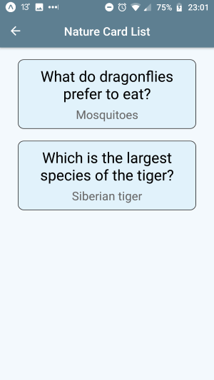

The header is the deck's title card list. The cards from the deck are shown in chronological order so the user can read them through.

### Quiz view

#### Question

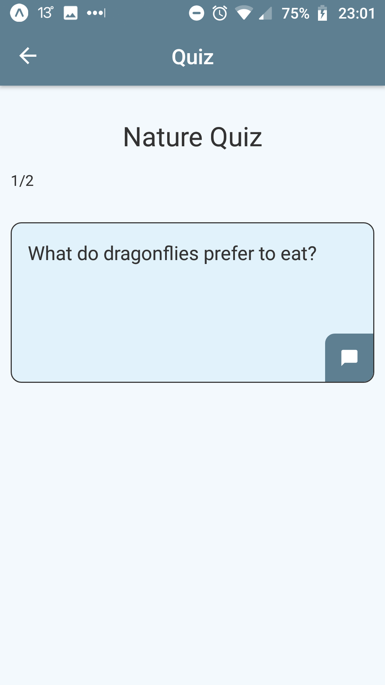

The header is Quiz. The deck's title, the number of the current card and the number of all cards in the deck, the question and a button for fade in to the answer are shown.

#### Answer

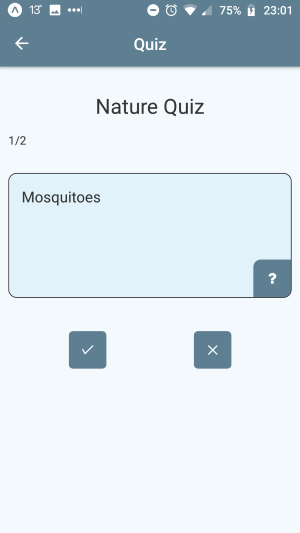

The header is Quiz. The deck's title, the number of the current card and the number of all cards in the deck, the answer, a button for fade in to the question, and two answer buttons are shown. The left answer button is for correct, the right answer button for the wrong answers. Pressing any answer button fade in to the next question. Pressing the correct button, adds to the point counter.

#### Passed

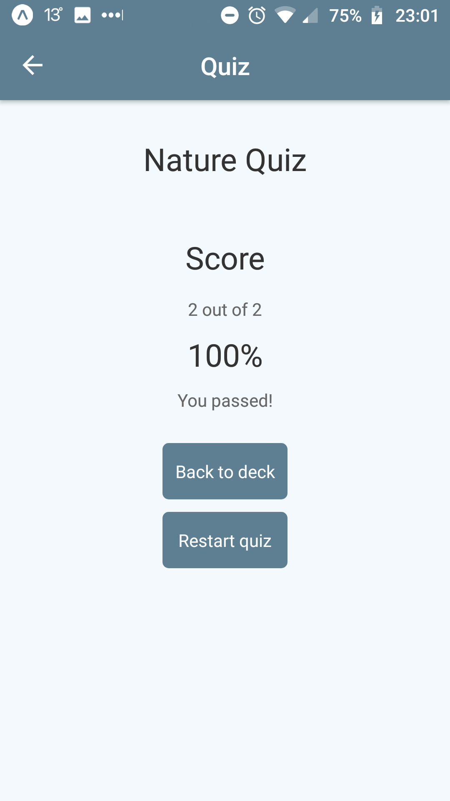

The header is Quiz. The deck's title, statistics of the quiz and two buttons are shown. If the user got 50% or more, they pass and You passed! is shown. The Back to deck button routes back to the deck. The restart quiz starts the quiz over.

#### Failed

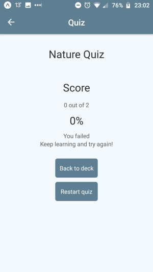

The header is Quiz. The deck's title, statistics of the quiz and two buttons are shown. If the user got less than 50%, they pass and You failed! is shown and an advice to keep learning. The Back to deck button routes back to the deck. The restart quiz starts the quiz over.

## Notification

The notification is sent if the user didn't completed a quiz until 20:00.
To change the timing of the notification, modify the
```
tomorrow.setHours(20)
tomorrow.setMinutes(0)
```
in the utils/api.js file's `setLocalNotification()` method.

## Platform

The app was tested on Android device.